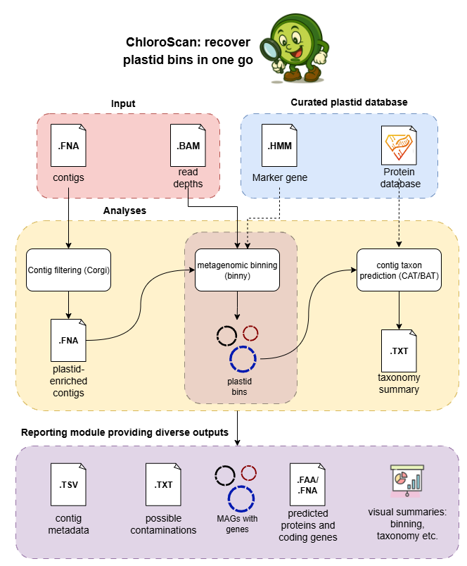

==================================================================
ChloroScan: A metagenomic workflow to recover chloroplast genomes
==================================================================

.. start-badges

|testing badge| |docs badge|

.. |testing badge| image:: https://github.com/Andyargueasae/chloroscan/actions/workflows/testing.yml/badge.svg
    :target: https://github.com/Andyargueasae/chloroscan/actions

.. |docs badge| image:: https://github.com/Andyargueasae/chloroscan/actions/workflows/docs.yml/badge.svg
    :target: https://Andyargueasae.github.io/chloroscan
    
.. end-badges

This workflow is designed to recover chloroplast genomes from metagenomic datasets.

.. image:: docs/source/_static/ChloroScan-Thumbnail.png
    :alt: ChloroScan Poster
    :align: right
    :width: 200px
    :target: docs/source/ChloroScanPoster.pdf

Installation
============

To install the workflow, use pip3:

.. code-block:: bash

    pip3 install chloroscan==0.1.5

Detailed workflow instructions can be found at: https://andyargueasae.github.io/chloroscan/index.html

Machine/OS Requirements
=======================
ChloroScan is only tested on Linux (x86_64), running on IOS system is not recommended.

Configuration databases
=======================
Before running ChloroScan, some packages and datasets need to be installed to run CAT taxonomy prediction properly.

ChloroScan incorporates a marker gene database while running binning, you don't need to do anything, it will be loaded since you build conda environments.

To download our curated Uniref90-algae plastid protein database, use the link: https://doi.org/10.26188/27990278. 

To avoid authentication issues, try the command below to download it:

.. code-block:: bash

    wget --referer=https://figshare.unimelb.edu.au --user-agent="Mozilla/5.0" -O "CAT_db.tar.gz" https://figshare.unimelb.edu.au/ndownloader/files/51053993

``Note``: The tar.gz format of CAT database's size is 47GB, and nearly 85GB after unzipped, please ensure you have enough disk storage. 

Sample data to try
==================
To try ChloroScan, I recommend downloading our synthetic metagenome data via the command: 

.. code-block:: bash

    wget --referer=https://figshare.unimelb.edu.au --user-agent="Mozilla/5.0" -O "synthetic_sample_II.tar.gz" https://figshare.unimelb.edu.au/ndownloader/files/53499140

Wanna try real-data derived test sample? See them here: https://figshare.unimelb.edu.au/articles/dataset/ChloroScan_test_data/30218614.

Credit
============

ChloroScan is developed by:

.. start-credits

- Yuhao Tong (University of Melbourne)
- `Dr Robert Turnbull <https://findanexpert.unimelb.edu.au/profile/877006-robert-turnbull>`_ 
- `Dr Vanessa Rossetto Marcelino <https://findanexpert.unimelb.edu.au/profile/532755-vanessa-rossetto-marcelino>`_ 
- `A/Prof Heroen Verbruggen <https://hverbruggen.github.io/>`_

.. end-credits

Citation (IEEE)
===========
When using ChloroScan, please also cite: Corgi, binny, CAT/BAT, snakemake, snk, FragGeneScanRs and Kronatools. 

.. code-block:: text

    1. A. arguease, Andyargueasae/chloroscan. (Sep. 27, 2025). HTML. Accessed: Oct. 02, 2025. [Online]. Available: https://github.com/Andyargueasae/chloroscan.
    2. O. Hickl, P. Queirós, P. Wilmes, P. May, and A. Heintz-Buschart, “binny : an automated binning algorithm to recover high-quality genomes from complex metagenomic datasets,” Briefings in Bioinformatics, vol. 23, no. 6, p. bbac431, Nov. 2022, doi: 10.1093/bib/bbac431.
    3. F. A. B. von Meijenfeldt, K. Arkhipova, D. D. Cambuy, F. H. Coutinho, and B. E. Dutilh, “Robust taxonomic classification of uncharted microbial sequences and bins with CAT and BAT,” Genome Biology, vol. 20, no. 1, p. 217, Oct. 2019, doi: 10.1186/s13059-019-1817-x.
    4. R. Turnbull, rbturnbull/corgi. (Sep. 16, 2025). Python. Accessed: Oct. 02, 2025. [Online]. Available: https://github.com/rbturnbull/corgi
    5. B. D. Ondov, N. H. Bergman, and A. M. Phillippy, “Interactive metagenomic visualization in a Web browser,” BMC Bioinformatics, vol. 12, no. 1, p. 385, Sep. 2011, doi: 10.1186/1471-2105-12-385. 
    6. F. Mölder et al., “Sustainable data analysis with Snakemake,” F1000Res, vol. 10, p. 33, Jan. 2021, doi: 10.12688/f1000research.29032.1. 
    7. W. Wirth, S. Mutch, and R. Turnbull, “Snk: A Snakemake CLI and Workflow Management System,” JOSS, vol. 9, no. 103, p. 7410, Nov. 2024, doi: 10.21105/joss.07410.
    8.  F. Van der Jeugt, P. Dawyndt, and B. Mesuere, “FragGeneScanRs: faster gene prediction for short reads,” BMC Bioinformatics, vol. 23, no. 1, p. 198, May 2022, doi: 10.1186/s12859-022-04736-5.

