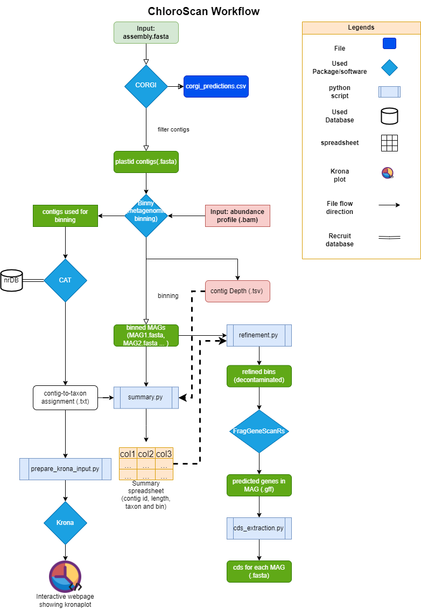

==================================================================
ChloroScan: A metagenomic workflow to recover chloroplast genomes.
==================================================================

Author: Yuhao Tong (The University of Melbourne)

.. image:: https://github.com/Andyargueasae/chloroscan/badge.svg
   :target: https://github.com/Andyargueasae/chloroscan/badge.svg
   :alt: example workflow

A snakemake workflow for MMA metagenomics for recovering chloroplast genomes.
=============================================================================

Project implementation commence date: August 8th, 2023
This workflow will try to cover all essential steps in order to get down the genomics-based metagenomic analysis in recovering algal plastidial genomes.
Before starting the new jobs:

#. Set-up the binny workflow within ChloroScan working directory. 
#. Set-up the CAT-taxonomy identification database, for details please see this: https://tbb.bio.uu.nl/bastiaan/CAT_prepare/
#. Make sure the FragGeneScanRs is added to your path.

All steps above have been covered by running autoInit.sh.

Modules of the workflow:

#. bio-corgi: Contig classification to filter out plastid contigs.
#. binny (Customized for ChloroScan): cluster contigs into bins/Metagenome-Assembled genomes (MAGs).
#. CAT/BAT: the taxonomy assignment of each contig to help identifying the taxon of bins (this workflow uses conda version of CAT/BAT, meanwhile the nr database has been updated to 2023/11/20).
#. summary.py: The tabular storing of binning and taxonomic identification info that can augment further interpretation of the data. 
#. visualization.py: using the spreadsheet output from summary.py, visualize contig clustering info via scatterplot, taxonomy via pie chart and contig depth violin plot.
#. refinement.py: remove contigs within bins that are "not taxonomically identified as eukaryotic" AND contains no markers predicted from database used by binny.   
#. CDS extraction: FragGeneScanRs (installed via cargo) predicts ORF from contigs and gffread will turn gff files into fasta format to enable downstream analysis.
#. Dataset microbial community visualization: via Krona, that produces a pie chart to visualize microbial taxonomic groups in metagenome. 

Currently ChloroScan is only available via from-resource installation.

Once the workflow gets finished, the recovered MAGs will be passed to the snakemake workflow Orthoflow (https://rbturnbull.github.io/orthoflow/main/installation.html), to conduct the phylogenetic analysis and see if there any new insights brought by these MAGs.

To install ChloroScan from resource:

.. code-block:: bash
   
   git clone https://github.com/Andyargueasae/chloroscan.git
   cd chloroscan
   poetry install
   poetry shell

Future Update:

1. Comprehensive algae lineage-specific marker gene database (**in development**).

For detailed information for installation, fine-tuning workflow and instruction of configuration of ChloroScan, please don't hesitate to visit the wiki website for details: https://andyargueasae.github.io/chloroscan/. And for further discussion of your bugs and difficulties in running ChloroScan, visit issues.  

