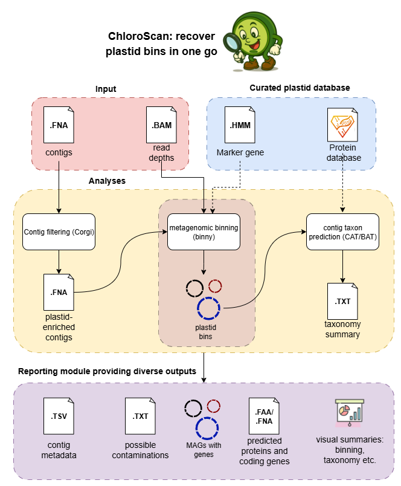

==================================================================
ChloroScan: A metagenomic workflow to recover chloroplast genomes
==================================================================

.. start-badges

|testing badge| |docs badge|

.. |testing badge| image:: https://github.com/Andyargueasae/chloroscan/actions/workflows/testing.yml/badge.svg
    :target: https://github.com/Andyargueasae/chloroscan/actions

.. |docs badge| image:: https://github.com/Andyargueasae/chloroscan/actions/workflows/docs.yml/badge.svg
    :target: https://Andyargueasae.github.io/chloroscan
    
.. end-badges

This workflow is designed to recover chloroplast genomes from metagenomic datasets.

Installation
============

**Before downloading, ensure you have effective mamba and conda working in your server, we recommend the version to be mamba 1.4.2 and conda 23.3.1. Instructions of download is documented here: https://github.com/conda-forge/miniforge.**

To install the workflow, use pip3. The background environment will require Python <3.12, >=3.9 to set up the virtual environment. We recommend Python 3.10.

.. code-block:: bash

    pip3 install chloroscan==0.1.5

Detailed workflow instructions can be found at: https://andyargueasae.github.io/chloroscan/index.html.
The website also contains Chinese version of the documentation with identical contents.

Machine/OS Requirements
=======================
ChloroScan is only tested on Linux (x86_64), running on IOS system is not recommended. 
ChloroScan can be installed on servers with hpc clusters and it is recommended to use a GPU to accelerate its running.

``Note``: Through testing, current version of chloroscan cannot support NVIDIA H-100 GPU, due to cuda version incompatibilities. We will work on updating it to allow better performances. 

Configuration databases
=======================
Before running ChloroScan, some packages and datasets need to be installed to run CAT taxonomy prediction properly.
ChloroScan incorporates a marker gene database while running binning, you don't need to do anything, it will be loaded since you build conda environments.
To download our curated Uniref90-algae plastid protein database, use the link: https://doi.org/10.26188/27990278. 

To avoid authentication issues, we recommend using the pyfigshare command-line tool to download. The information of this tool can be found at: ``https://pypi.org/project/pyfigshare/``. 
* **Python > 3.0** is required to download pyfigshare.

Before downloading the files, set up your own figshare account and add an api token to the file ~/.figshare/token in your server.

Then run:

.. code-block:: bash

    figshare download -o CAT_db.tar.gz 27990278

``Note``: The tar.gz format of CAT database's size is 47GB, and nearly 85GB after unzipped, please ensure you have enough disk storage. Meanwhile, the space to setup the conda environment also requires 15 GB of disk.  

Sample data to try
==================
To try ChloroScan, I recommend downloading our synthetic metagenome data via the command: 

.. code-block:: bash

    figshare download -o simulated_metagenomes.tar.gz 28748540

There are also some real metagenome datasets (modified to keep them lightweight) available at: https://figshare.unimelb.edu.au/articles/dataset/ChloroScan_test_data/30218614.

To download:

.. code-block:: bash

    figshare download -o real_test_samples.tar.gz 30218614

Credit
============

ChloroScan is developed by:

.. start-credits

- Yuhao Tong 童禹皓 (University of Melbourne)
- `Dr Robert Turnbull <https://findanexpert.unimelb.edu.au/profile/877006-robert-turnbull>`_ 
- `Dr Vanessa Rossetto Marcelino <https://findanexpert.unimelb.edu.au/profile/532755-vanessa-rossetto-marcelino>`_ 
- `A/Prof Heroen Verbruggen <https://hverbruggen.github.io/>`_

.. end-credits

With Yuhao Tong the primary developer, if you want to contact us, please email to:

.. code-block:: text
    
    yuhtong@student.unimelb.edu.au

下载
============================

**下载之前，确保您的服务器已经下载好mamba和conda。我们推荐的版本是 mamba 1.4.2 和 conda 23.3.1。关于如何下载请参见：https://github.com/conda-forge/miniforge。**

要安装工作流，请使用 pip3。背景环境需要 Python <3.12, >=3.9 来设置虚拟环境。我们推荐python 3.10。

.. code-block:: bash

    pip3 install chloroscan==0.1.5

详细的工作流说明可以在以下链接找到：https://andyargueasae.github.io/chloroscan/index.html。
该网站还包含中文版本的文档，内容完全相同。

机器/操作系统要求
============================

ChloroScan 仅在 Linux (x86_64) 上测试，建议不要在 IOS 系统上运行。
ChloroScan 可以安装在具有 hpc 集群的服务器上，建议使用 GPU 来加速运行。

``注意``：通过测试，当前版本的 chloroscan 无法支持 NVIDIA H-100 GPU，因为 cuda 版本不兼容。我们将努力更新它以允许更好的性能。

配置数据库
============================

在运行 ChloroScan 之前，需要安装一些软件包和数据集以正确运行。

ChloroScan 在运行分箱时包含一个标记基因数据库，您无需做任何事情，它将在您构建 conda 环境时加载。
要下载我们经过整理的 Uniref90-algae plastid 蛋白质数据库，请使用以下链接：https://doi.org/10.26188/27990278。

为了避免认证问题，我们建议使用 pyfigshare 命令行工具进行下载。有关此工具的信息可以在以下链接找到：``https://pypi.org/project/pyfigshare/``。
* **Python > 3.0** 是下载 pyfigshare 的必要条件。

在下载文件之前，设置您自己的 figshare 账户，并将 api 密匙添加到你服务器的文件 ~/.figshare/token 中。
然后运行：

.. code-block:: bash

    figshare download -o CAT_db.tar.gz 27990278

``注意``：CAT 数据库的 tar.gz 格式大小为 47GB，解压后约为 85GB，请确保您有足够的磁盘存储空间。同时，设置 conda 环境的空间也需要 15 GB 的磁盘。

试用样本数据
============================

要试用 ChloroScan，我建议通过以下命令下载我们的合成宏基因组数据：

.. code-block:: bash

    figshare download -o simulated_metagenomes.tar.gz 28748540

还有一些真实的宏基因组数据集（经过修改以保持其不占用太多磁盘空间，但原始数据信息并未抹除）可在以下链接找到：https://figshare.unimelb.edu.au/articles/dataset/ChloroScan_test_data/30218614。

用户可通过如下方式下载：

.. code-block:: bash

    figshare download -o real_test_samples.tar.gz 30218614

联系方式
============================

请联系我们：

.. code-block:: text

    yuhtong@student.unimelb.edu.au

