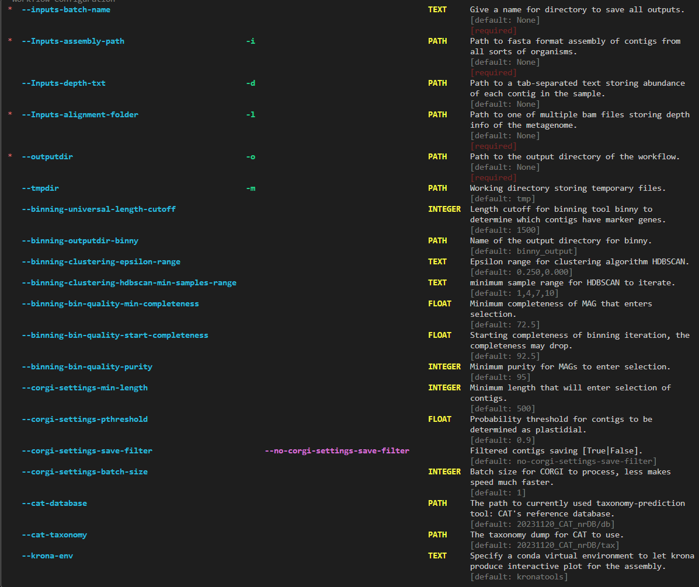

===================
Beginner's tutorial
===================

Data Input and configuration
============================

The pip version of ChloroScan accepts following arguments:

Among these arguments, only assembly path, depth text, alignment folder and a batch name are required for ChloroScan to run.

Please prepare your assembly in unziped fasta format to allow for processing. 

The sequence alignment folder should contain sorted.bam files to map each contig's sequence coverage in assembly.

An example command for running ChloroScan if depth text file is available:

.. code-block:: bash

   chloroscan run --Inputs-assembly-path assembly.fasta --Inputs-depth-txt depth.txt --Inputs-batch-name BATCH_NAME --outputdir OUTPUT_DIR --cores N_CORES 

An example command for running ChloroScan if depth text file is not available:

.. code-block:: bash

   chloroscan run --Inputs-assembly-path assembly.fasta --Inputs-batch-name BATCH_NAME --outputdir OUTPUT_DIR --alignment-folder ALIGNMENT_FOLDER

Explaining the non-required arguments
=====================================

Some parameters are not required, but changing them can impact the outcomes and running processes, here are some instructions.

1. CORGI settings
-----------------

CORGI is responsible for contig filtering to extract chloroplast contigs. The default device of CORGI is GPU.

- ``--corgi-settings-min-length``: Minimum length of contigs to be considered for chloroplast contigs. Default is 500. 

- ``--corgi-settings-pthreshold``: P-value threshold for filtering contigs. Default is 0.90. Bigger value means more stringent filtering.

- ``--corgi-settings-save-filtering``: Whether to save the filtered contigs using CORGI. Default is False and the customized python scripts in chloroscan could achieve quite fast writing speed.

- ``--corgi-settings-batch-size``: number of contigs to be processed in one batch. Default is 1. Smaller batch size can reduce memory usage and elevate speed. 

2. Binning module settings
--------------------------

- ``--binning-universal-length-cutoff``: The length cutoff for all contigs that enters selection regardless of presenting marker genes. Default is 1500.

- ``--binning-clustering-epsilon_range``: The range of epsilon for HDBSCAN clustering. Default is "0.250,0.000". Larger range takes more time to finish the clustering.

- ``--binning-clustering-hdbscan-min_samples``: The minimum number of samples in a cluster. Default is 1,4,7,10. Picking smaller values can lead to more clusters but cluster contents may be spurious.

- ``--binning-bin-quality-min_completeness``: Minimum completeness for MAGs to enter selection. Default is 72.5.

- ``--binning-bin-quality-starting-completeness``: Starting completeness for MAGs to enter selection. Default is 92.5, note that the range between starting and min completeness affects the quality selections of bins.

- ``--binning-bin-quality-purity``: Purity cutoff for MAGs to enter selection. Default is 95.

3. Homology-based taxonomy prediction by CAT
--------------------------------------------

- ``CAT-database``: The database used for taxonomy prediction by CAT/BAT, ensure this is an absolute path.

- ``CAT-taxonomy``: The taxonomy dump file for CAT to use. Ensure this path is an absolute path.

4. Other settings
-----------------

- ``outputdir``: The output directory for the workflow's results, usually named after batch name.

- ``tmpdir``: Temporary directory for storing intermediate files. Default is /tmp.

.. note::

   Currently the pip version of chloroscan recommends to use a snakemake virtual environment with snakemake=6.15.5 installed for binny's module to use. 
   Otherwise the binny module might fail while running.   

5. Cooperate with Anvi'o to make sense of your database
-------------------------------------------------------

Anvi'o is a powerful tool for visualizing and analyzing metagenomic data. After running ChloroScan, you can use Anvi'o to visualize the results and gain insights into your data.
Potentially it can help you to refine the plastid MAGs. 

The inputs required for Anvi'o are:
- ``reformatted fasta-format assembly``: Filtered contigs from contig classification module, anvi-script-reformat-fasta can take the assembly and output this file.
- ``bam files``: sorted.bam files that contains all contigs in the filtered assembly. Original bam files will fail anvi'o's workflow, so users can use bowtie2/minimap2 to map their raw reads back to the assembly and generate the bam files.
- ``binning collection (tsv)``: The binning mapping file, with the first column being the contig id and the seconda column being the bin id.

After doing these, you can put these data to anvi'o for further analysis. 