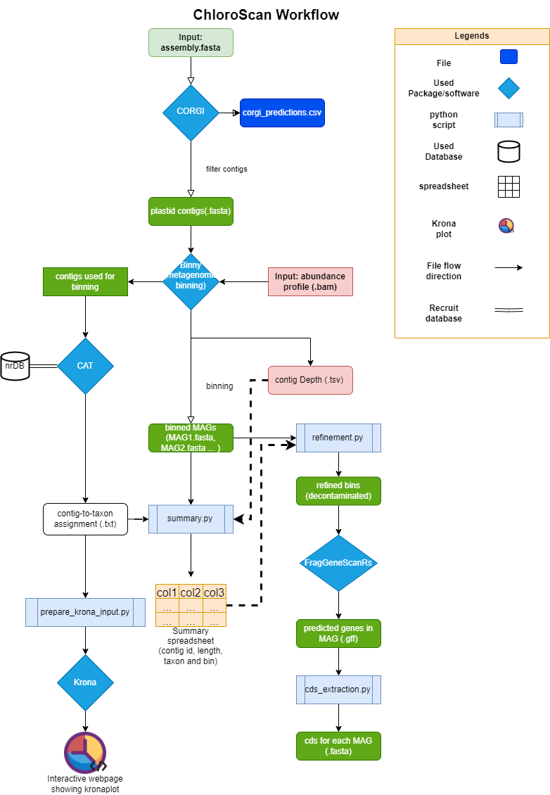

===================
Beginner's tutorial
===================

Data Input and configuration
============================

OK, now you have installed all required packages and databases, the workflow is ready to go. Before getting into your jobs, let's familiarize ourselves with the input of data and how to configure other parameters.

The input of ChloroScan workflow is in yaml format, it is generally splitted in several chunks:

.. code-block:: yaml

    Inputs:
        # This is a default configuration file for the MMA organelle metagenomics workflow.  
        batch_name: "BATCH_NAME"
        assembly_path: "path/to/your/fasta_file.fasta"
        # PATH/to/ASSEMBLY_FASTA
        alignment_files: "path/to/your/assembly_abundance_profile.bam"
        # PATH/TO/ALIGNMENT_BAMS
        depth_txt: "path/to/your/contig_depth.txt" 
        #PATH/TO/DEPTH.TXT

The first chunk specifies the input assembly in fasta format, and abundance info in either tab-separated txt or bam format.

Now, binning is the core process in this workflow, and its configuration may directly affect the performance. In order to adjust some key parameters, ChloroScan adopted several hyperparameter adjustments from config files of binny:

.. code-block:: yaml

    binny_settings:
    universal_length_cutoff: 1500
    outputdir_binny: "binny_output" # May require wildcards for those things, should we in other words name this after batch? 
    clustering: 
        # majorly adjust the hdbscan values. Recommended to be fixed. Or can be changed via here.
        epsilon_range: '0.250,0.000'
        hdbscan_min_samples_range: '1,4,7,10'
    bin_quality:
        min_completeness: 75
        start_completeness: 92.5
        purity: 95

By adjusting the contig length cutoff, clustering parameters such as epsilon range and min sample range (binny uses HDBSCAN as its clustering algorithm), ChloroScan generally optimizes the potential to recover near complete chloroplast genomes.

Another Major component is the classification of contigs using CORGI, a neural network based on autoencoder, so hyperparameters also affects its performance:

.. code-block:: yaml

    corgi_settings:
    # corgi has settings for minimum length, pthreshold settings yes or no.
    minlen: INTEGER
    # set it up for saving computational resources.
    pthreshold: FLOAT
    # Hit it by having an exact value or "False".
    save_filter: "True"
    # If true: we automatically send the fasta file into the folder.
    batch_size: INTEGER
    #leave for changing.

Minlen (i.e: minimum length cutoff for contigs to be classified) may affect the precision of classification as generally longer contigs are classified with high accuracy. Pthreshold is the threshold cutoff for each contig to be classified. Generally higher cutoff results in higher certainty for one contig's identity. 
Batch_size is recommended to be set to 1, when users' virtual machine has gpu, the speed might be good enough that batch size may not help accelerating the process. 

Besides, there are some individual configurations that specifies directory of use.

.. code-block:: yaml

    # Give a name for your sample(s). Should we name this for each batch?
    outputdir: "TEST_OUT"
    # output folder where files are going to be moved into. But wait? We need to separate it by batches!
    tmpdir: "tmp"

These two configurations specifies the temporary directory and the output directory path.

.. code-block:: yaml

    CAT_database: "20231120_CAT_nrDB/db"
    CAT_taxonomy: "20231120_CAT_nrDB/tax"

These two configurations provide the path to the non-redundant protein database (db for diamond database, tax for taxonomy directory) within ChloroScan directory. CAT will need these.

.. code-block:: yaml

    Krona_env: "kronatools"

This configuration allows users to customize a virtual environment with installed Kronatools package, that finally draws a krona plot of the filtered-datset.

.. code-block:: yaml

    threads: 11
Specify number of cores to be used by the workflow. 

Running ChloroScan
==================

ChloroScan is easily to run, by running the ChloroScan.sh the snakemake workflow is activated. Here is a sample code. (Note: Always remember to add double quotation marks for non-digit arguments)

.. code-block:: bash

    cd chloroscan
    ./ChloroScan.sh -a "path/to/assembly.fasta" -b "BATCH_NAME" -e "CONDA_ENV" -m "BAM_FILE" -n MIN_LENGTH_CUTOFF_CORGI -k CORGI_BATCH_SIZE -p PROBABILITY_THRESHOLD -t THREAD

Process and Output explained in a nutshell
==========================================
ChloroScan workflow is designed to have 8 major steps: First the plastid contigs will be classified by CORGI from the assembly. Second, the sequence depth profile and plastid contigs will be the inputs of binny to get clustered into bins. step 3 is to use CAT/BAT to predict the taxon for each contig. Then step 4 to 8 is a series of customized python script running that pools the clustering information into a spreadsheet and provides visualizations.
Finally, FragGeneScanRs plus gffread will extract cds information from MAGs and the workflow is finished. The results can be subject to downstream analysis such as phylogenomics.

Here is a figure for an overview:

Generally, the workflow will run in the following 3 scenarios:

1. If there were no plastid contigs classified, the workflow pre-terminates after CORGI finishes its run.
2. If there are plastid contigs, but they failed to be clustered into bins, the workflow summarizes their basic information into a spreadsheet and exits.
3. If the plastid contigs get clustered, ChloroScan will run a series of summary and visualization to help users explore the chloroplast genomes in the assembly.

So for scenario 1, the output would only be corgi results, stored in the individual "corgi" directory.
While for scenario 2 & 3, all downstream steps would be executed, its just that only scenario 3 provides full-scope results.

Let's dive a bit deeper into these outputs:
1. CORGI: generally, CORGI takes the unfiltered assembly file in fasta, to classify contigs into 5 categories: archaea, bacteria, eukaryotes, plastid, mitochondria.
In ChloroScan, we will only focus on the part of plastids, so later the accompanied scripts will extract the accession of contigs classified as plastid and write these contigs to **"plastid.fasta"**.

2. Binny: This is the core of the ChloroScan workflow, by clustering contigs into "bins", also known as "Metagenome-assembled genomes" (MAGs). 
Binny takes the assembly "plastid.fasta" from corgi's output, along with assembly abundance profile for each contig in sample(s), thus extracting their tetranucleotide frequencies + coverage, and cluster the bins.
Bins will then be estimated with completeness and purity using the CheckM framework: marker gene datasets. Bins with these metrics exceeding thresholds will be remained.
Currently, ChloroScan only have a basal small-sized marker gene database for binny to use to ensure fundamental extraction of photosynthetic plastids. While there is a larger and more comprehensive database under development (A2K project), hopefully it will assign more accurate taxa to MAGs, and covers a wide breadth of lineages.
Finally, in output_dir/working/binny, the bins/ directory stores all bins. 

3. CAT: this package is responsible for the taxonomy assignment to contigs via ORF scanning. In other words, it works as a benchmarking tool for ChloroScan: testing how good that CORGI and binny coops to extract plastid MAGs. Finally it outputs a directory containing several files, with contig2classification tsv file the major output to save results of contigs taxonomic identification.

4. refinement of bins: Based on annotated genes along with CAT-determined taxon, the bins reconstructed will be refined by removing those putative contaminations (criteria: contig is without a reliable taxonomic identification pointing it to protozoa, plus no markers annotated). 

5. summarization: Outputs a spreadsheet that stores all sorts of information for contigs that are inputed to binny (from plastid assembly with a length over 500 bp). 

6. Exploration of dataset taxonomic composition via Krona: "kronatools" module will incorporate CAT's results and output a webpage showing a krona-style pie chart.

7. **Final output: CDS extraction**. All bins' coding sequences in fasta format will be generated via FragGeneScanRs and gffread module, to work as ultimate output of ChloroScan that can be fed into downstream analysis, for example: phylogenetic inference.

Running individual rules
========================

The snakemake backbone offers users to run the individual jobs, to do just follow the codes below:

.. code-block:: bash

    chloroscan run --config=PATH/TO/CONFIGFILE --snakefile=PATH/TO/SNAKEFILE --cores=N_CORES --use-conda --conda-prefix=PATH/TO/CONDA/ TARGET_FILE

Target files are the outputs from rules of snakemake workflow which can be found in Snakefile. 